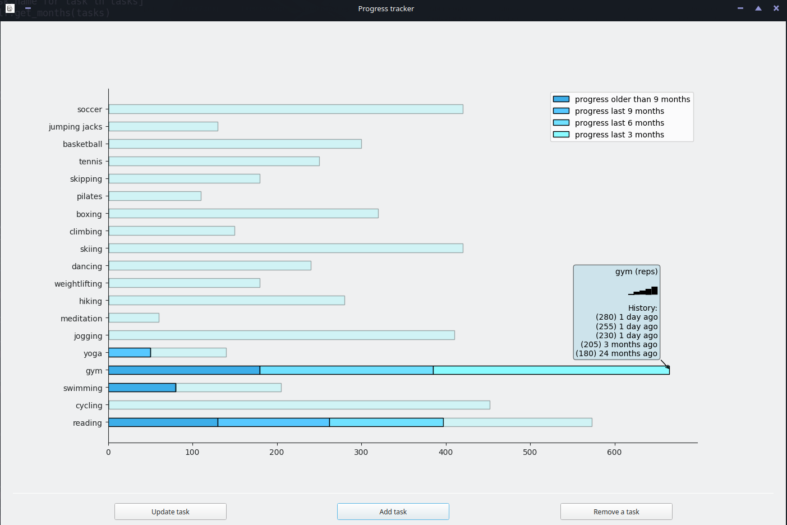
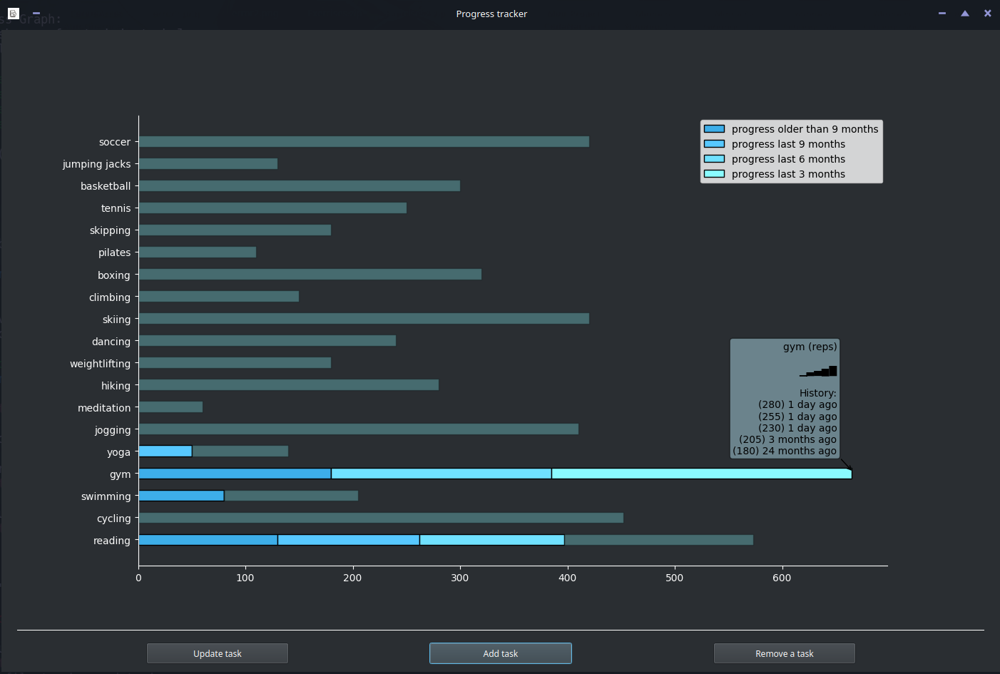

# Progress tracker app

Very simple app to visually display your progress on whatever it is you want to
accomplish.

Just create a task for whatever it is you want to keep track of, and then the
app will take care of the rest.

Ideal for visualizing your progress, seeing where you have work to do, and
overall bragging to your friends that your bars hit harder than theirs.

## Running the app

Install the requirements in `requirements.txt`, and then run the app with:

```
python main.py
```

The app will save a `tracker.json` file to `$XDG_DATA_HOME/`, or to
`~/.local/share/` if the first is not available, which contains the information
about your progression.

Alternatively, you can move this file around. Just pass the path to it to the
app:

```
python main.py --save-file tracker.json
```

## Screenshots

The app will try to respect your system settings for light / dark themes.




